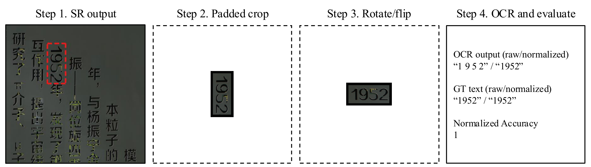
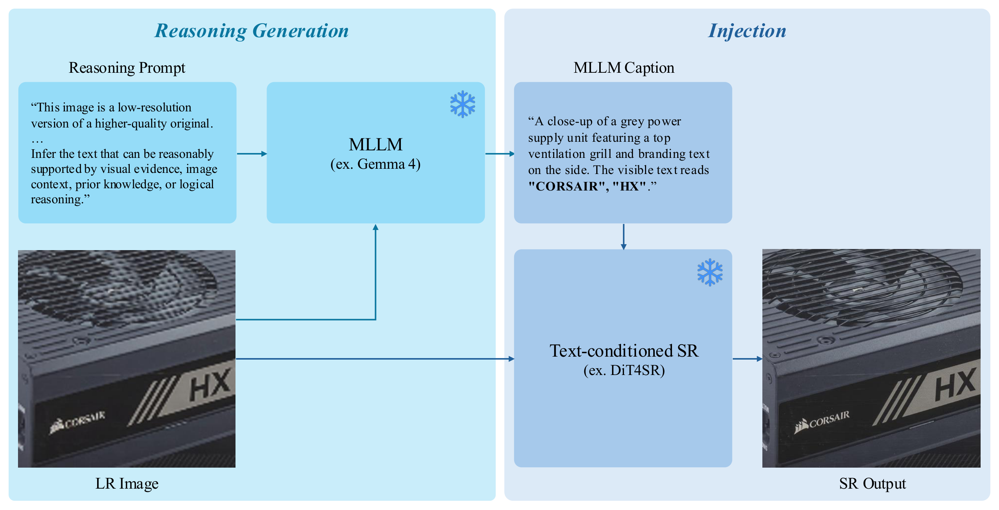

<div align="center">

# Reading the Unreadable: Text-Aware Image Super-Resolution Needs Reasoning

### NeurIPS 2026

[🌐 Project Page](https://example.com) · [📄 arXiv](https://example.com) · [📝 OpenReview](https://example.com) · [🤗 ReasonText Benchmark](https://huggingface.co/datasets/Jasonleex1995/ReasonText)

</div>

---

## 📏 ReasonText + GTTCA

<p align="center"></p>

1. Crop the text region of the SR output using the GT text polygon.
2. Reorient the cropped SR text using the GT text transformation.
3. Run OCR and evaluate normalized exact-match accuracy against the GT text.

### Installation

```bash
conda create -n gttca python=3.10 -y && conda activate gttca
pip install -r requirements_gttca.txt
```

### Weights & Data

- Download **[PaddleOCR-VL-1.5](https://huggingface.co/PaddlePaddle/PaddleOCR-VL-1.5)** and set its path in `gttca/weights_config.json`.
- Download the **[ReasonText benchmark](https://huggingface.co/datasets/Jasonleex1995/ReasonText)** for the GT polygons, transformations, and transcripts.
- Download the **[SR outputs](https://huggingface.co/datasets/Jasonleex1995/ReasonText-SR-outputs)** to reproduce our quantitative results.

### Measure GTTCA on ReasonText

```bash
python gttca/evaluate_gttca.py \
    --sr-dir     /path/to/sr_outputs/table4_rtc/B4_DiT4SR \
    --hr-dir     /path/to/ReasonText/HR \
    --meta-json  /path/to/ReasonText/ReasonText-meta.json \
    --weights-config gttca/weights_config.json \
    --output-dir ./results/DiT4SR_RTC/gttca \
    --model-name DiT4SR_RTC

python gttca/summarize.py --results-root ./results --output-dir ./results/summary
```

---

## 🧩 DiT4SR + RTC

<p align="center"></p>

1. Generate a reasoning caption from the LR image with an MLLM (Gemma-4).
2. Inject the caption into a text-conditioned SR backbone (DiT4SR) to restore the image.

### Installation

```bash
conda create -n rtc python=3.11 -y && conda activate rtc
pip install -r requirements_rtc.txt
```

### Weights & Data

- Download **[Stable Diffusion 3.5 Medium](https://huggingface.co/stabilityai/stable-diffusion-3.5-medium)** and set `SD35_PATH`.
- Download **[DiT4SR-Q](https://github.com/Adam-duan/DiT4SR)** and set `DIT4SR_Q_PATH`.
- Download **[Gemma-4 31B-it](https://huggingface.co/google/gemma-4-31B-it)** and set `GEMMA4_PATH`.
- Run on your own LR images, or use the ReasonText `LR/` images to reproduce our results.

### Running DiT4SR + RTC

```bash
GEMMA4_PATH=... SD35_PATH=... DIT4SR_Q_PATH=... \
  bash run_dit4sr_with_rtc.sh /path/to/your_LR ./results/my_run
```

<details><summary>… or as two explicit steps (caption → SR)</summary>

```bash
python captioning/caption_gemma4.py --input_dir /path/to/your_LR --output my_captions.json
python DiT4SR/run_dit4sr_from_caption.py --image_path /path/to/your_LR \
    --caption_json my_captions.json --output_dir ./results/my_run/images
```

To reproduce our exact SR images on ReasonText, pass the shipped `captioning/reason_captions.json` to `run_dit4sr_from_caption.py`.
</details>

To score these outputs, use **ReasonText + GTTCA** above.

---

## 📁 Repository layout

```
captioning/   RTC Stage 1 — MLLM captioning with the reasoning prompt (backbone-independent)
DiT4SR/       RTC Stage 2 — DiT4SR backbone + our entry point
gttca/        GTTCA metric — evaluate_gttca.py · summarize.py · weights_config.json
```

Everything is ours **except** `DiT4SR/{pipelines,model_dit4sr,utils}/` ([Adam-duan/DiT4SR](https://github.com/Adam-duan/DiT4SR), unmodified — see `DiT4SR/LICENSE`). RTC is training-free: it only swaps DiT4SR's built-in captioner for a reasoning caption.

## 📝 Citation

If you use this work, please cite our paper (and RealSR-v3 / DRealSR, which ReasonText is built on):

```bibtex
<bibtex — fill in>
```

## 🙏 Acknowledgements

[DiT4SR](https://github.com/Adam-duan/DiT4SR), Stable Diffusion 3.5 (Stability AI), Gemma-4 (Google), PaddleOCR-VL (PaddlePaddle), and the RealSR-v3 / DRealSR datasets.

## ⚖️ License

Released for **non-commercial research use only** under **CC BY-NC 4.0** (see [`LICENSE`](LICENSE)). The bundled DiT4SR backbone keeps its own license (`DiT4SR/LICENSE`); model weights and source datasets are governed by their own terms.
